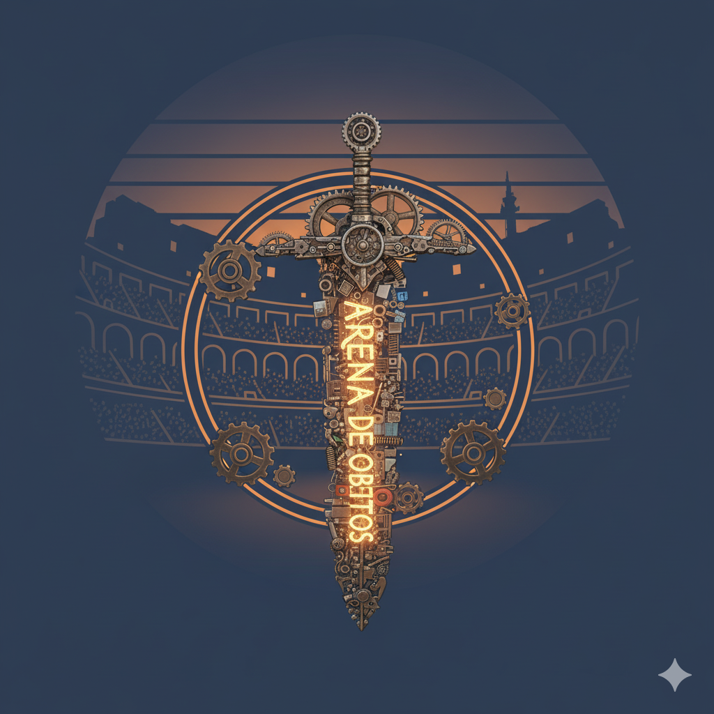

<p align="center">
  
</p>


# 🏟️ ArenaDeObjetos

**ArenaDeObjetos** é um projeto em Java com objetivo de estudo, no qual objetos “lutam” entre si (conceito de combate, atributos, etc.).  
Serve como laboratório de Programação Orientada a Objetos, lógica e domínio de classes.

---

## 🎯 Funcionalidades

- Criação de objetos com atributos diferentes (vida, força, defesa, etc)  
- Mecânica de combate entre os objetos (turnos, danos, interações)  
- Regras de vitória / derrota  
- Estrutura modular separando lógica de domínio e interface  
- (Opcional) Extensão futura: interface gráfica, AI para oponentes, torneios

---

## 🏗️ Estrutura do Projeto

ArenadeObjetos/
├── src/
│ └── (código-fonte Java)
├── bin/
│ └── (arquivos compilados)
├── nbproject/
│ └── configurações de projeto (NetBeans)
├── build.xml
├── manifest.mf
└── .gitignore


- **src/** — Classes e pacotes do jogo  
- **bin/** — Arquivos compilados (output do build)  
- **nbproject/** — Configurações do NetBeans  
- **build.xml** — Script de compilação (Ant)  
- **manifest.mf** — Manifesto do jar  
- **.gitignore** — Arquivos/pastas ignorados no Git

---

## 🛠️ Tecnologias & Ferramentas

- Linguagem: **Java**  
- Build: **Ant**  
- IDE sugerida: **NetBeans / IntelliJ / VS Code (com extensão Java)**  
- Conceitos aplicados: **POO, herança, polimorfismo, encapsulamento, lógica de combate**

---

## 📥 Como executar / compilar

1. Clone este repositório:  
   ```bash
   git clone https://github.com/Gabrielli-Rech/ArenadeObjetos.git

2. Navegue até a pasta do projeto:
cd ArenadeObjetos

3. Compile com o Ant (se tiver instalado):
ant

4. Execute via terminal (apontando para a classe principal):

java -cp bin caminho.da.classe.Principal   

🧩 Possíveis melhorias / Roadmap

Interface gráfica (Swing ou JavaFX)

Inteligência artificial para lutar automaticamente

Modos de jogo: torneio, 1x1, time vs time

Persistência (salvar estado de jogo)

Aplicar padrões de design (Strategy, Observer, etc)

📄 Licença

Este projeto está sob a licença MIT — sinta-se livre para estudar, modificar e evoluir 🚀

